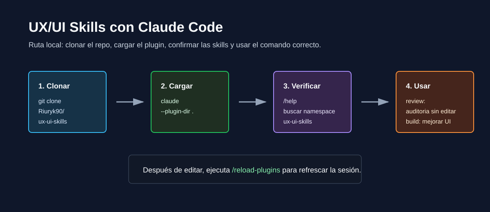
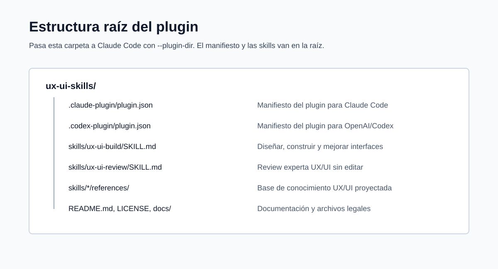
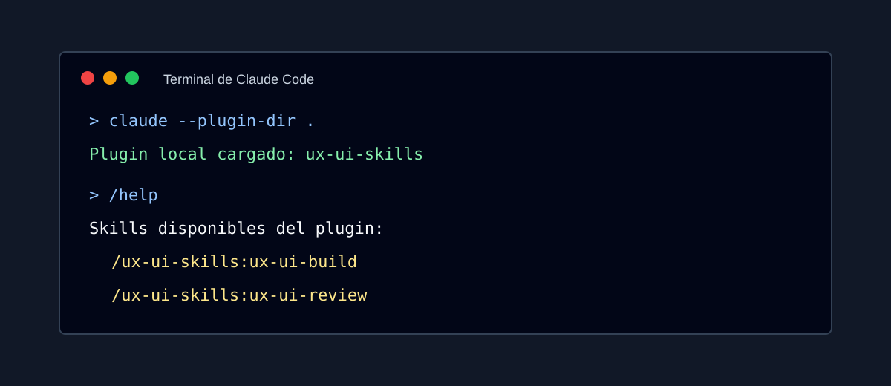

# Manual Local Para Claude Code

Esta guía explica cómo hacer funcionar `ux-ui-skills` de forma local con Claude Code.

APH significa "a prueba de humanos": cada paso te dice qué hacer, qué deberías ver y qué hacer si algo falla.



## Qué Estás Instalando

`ux-ui-skills` es un plugin para Claude Code con dos skills:

- `ux-ui-build`: úsala cuando quieras que Claude diseñe, construya, mejore o modifique una interfaz.
- `ux-ui-review`: úsala cuando quieras que Claude revise una interfaz existente sin editar archivos.

El plugin no agrega servidores MCP, hooks, servicios externos, inicios de sesión, tracking ni credenciales. Es un paquete solo de skills.

## Requisitos

Antes de tocar el plugin, asegúrate de tener:

- Claude Code instalado.
- Claude Code autenticado.
- Git instalado.
- Acceso a internet para clonar el repositorio.
- Una terminal donde el comando `claude` funcione.

En Windows, Claude Code puede correr de forma nativa desde PowerShell/CMD o dentro de WSL. Si usas Windows nativo, se recomienda Git for Windows para que Claude Code pueda usar Git Bash cuando lo necesite.

## Paso 1: Verificar Claude Code

Abre una terminal y ejecuta:

```bash
claude --version
```

Resultado esperado:

```text
Claude Code muestra un número de versión.
```

Luego ejecuta:

```bash
claude doctor
```

Resultado esperado:

```text
Claude Code muestra un reporte de salud y configuración.
```

Si `claude` no se reconoce como comando, instala o repara Claude Code antes de continuar.

## Paso 2: Clonar el Plugin

Elige una carpeta donde guardes herramientas o proyectos. Luego ejecuta:

```bash
git clone https://github.com/Riuryk90/ux-ui-skills.git
cd ux-ui-skills
```

Resultado esperado:

```text
Estás dentro de la carpeta ux-ui-skills.
```

Verifica que existan estas rutas:

```text
.claude-plugin/plugin.json
skills/ux-ui-build/SKILL.md
skills/ux-ui-review/SKILL.md
```



## Paso 3: Abrir Claude Code Con el Plugin

Desde dentro de la carpeta `ux-ui-skills`, ejecuta:

```bash
claude --plugin-dir .
```

Resultado esperado:

```text
Claude Code inicia normalmente y carga el plugin local para esta sesión.
```

Esto no instala el plugin de forma permanente. Solo lo carga para la sesión actual de Claude Code.

Si tu ruta tiene espacios, usa comillas:

```bash
claude --plugin-dir "C:\path with spaces\ux-ui-skills"
```

## Paso 4: Confirmar Que las Skills Cargaron

Dentro de Claude Code, ejecuta:

```text
/help
```

Busca el namespace del plugin:

```text
ux-ui-skills
```

Las skills deberían aparecer así:

```text
/ux-ui-skills:ux-ui-build
/ux-ui-skills:ux-ui-review
```



## Paso 5: Probar la Skill de Review

Usa esto cuando quieras solo análisis:

```text
/ux-ui-skills:ux-ui-review Review this interface for UX, accessibility, hierarchy, navigation, interaction, and evidence quality. Do not edit files.
```

Buenos usos:

- Revisar una captura de pantalla.
- Revisar una página existente.
- Revisar un componente.
- Revisar un flujo antes de implementarlo.
- Priorizar problemas por severidad y confianza.

Esta skill no debería modificar archivos.

## Paso 6: Probar la Skill de Build

Usa esto cuando quieras que Claude mejore o implemente:

```text
/ux-ui-skills:ux-ui-build Improve this interface. Prioritize clarity, responsive layout, accessibility signals, visual hierarchy, and practical implementation.
```

Buenos usos:

- Mejorar un formulario.
- Rediseñar un dashboard.
- Construir una landing page.
- Corregir un componente.
- Hacer una UI más usable en mobile y desktop.

Esta skill puede guiar cambios cuando tu tarea autoriza implementación.

## Paso 7: Recargar Después de Cambios

Si editas archivos del plugin mientras Claude Code ya está abierto, ejecuta:

```text
/reload-plugins
```

Resultado esperado:

```text
Claude recarga el plugin sin reiniciar la sesión.
```

## Paso 8: Validar el Plugin

Desde una terminal normal, dentro de la carpeta del plugin, ejecuta:

```bash
claude plugin validate .
```

Resultado esperado:

```text
Validation passed
```

Los warnings no siempre son fatales, pero los errores deben corregirse antes de enviar o compartir el plugin ampliamente.

## Comandos Rápidos Para Copiar

Prueba local desde cero:

```bash
git clone https://github.com/Riuryk90/ux-ui-skills.git
cd ux-ui-skills
claude --plugin-dir .
```

Ejecutar review:

```text
/ux-ui-skills:ux-ui-review Review this UI and prioritize the main UX issues. Do not edit files.
```

Ejecutar build:

```text
/ux-ui-skills:ux-ui-build Improve this UI with practical UX/UI changes and implementation guidance.
```

Recargar:

```text
/reload-plugins
```

Validar:

```bash
claude plugin validate .
```

## Solución de Problemas

### `claude` No Se Reconoce

Claude Code no está instalado, no está en tu PATH, o abriste la terminal antes de que terminara la instalación.

Prueba:

```bash
claude --version
```

Si sigue fallando, reinstala Claude Code y abre una terminal nueva.

### El Plugin Carga Pero No Aparecen las Skills

Ejecuta:

```text
/reload-plugins
```

Luego abre:

```text
/help
```

Si las skills aún no aparecen, revisa que hayas abierto Claude desde la raíz del plugin:

```bash
claude --plugin-dir .
```

La raíz del plugin es la carpeta que contiene `.claude-plugin/plugin.json`.

### Ves un Error de Carga del Plugin

Valida el plugin:

```bash
claude plugin validate .
```

Causas comunes:

- Abriste Claude desde la carpeta equivocada.
- Falta `.claude-plugin/plugin.json`.
- Falta `skills/ux-ui-build/SKILL.md`.
- Falta `skills/ux-ui-review/SKILL.md`.
- Se editó mal la sintaxis JSON.

### Quieres Probar un ZIP en Lugar de una Carpeta

Claude Code puede cargar un plugin desde un archivo `.zip` con `--plugin-dir` en versiones compatibles:

```bash
claude --plugin-dir ./ux-ui-skills.zip
```

Si el ZIP no carga, prueba primero la versión como carpeta:

```bash
claude --plugin-dir .
```

### Quieres Tenerlo Disponible Siempre

Para uso diario, el camino más simple sigue siendo:

```bash
claude --plugin-dir "path/to/ux-ui-skills"
```

Para distribución más amplia, usa un marketplace de Claude Code o envía el plugin a revisión de comunidad. La prueba local debería pasar antes de cualquiera de esos caminos.

## Notas de Seguridad

- Instala plugins solo desde fuentes confiables.
- Revisa los archivos del plugin antes de cargarlos.
- Este plugin es solo de skills y no incluye servidores MCP, hooks, ejecutables ni monitores en segundo plano.
- La skill de review está pensada para análisis y no debería editar archivos.
- La skill de build está pensada para implementación solo cuando el usuario pide implementación.

## Referencias Oficiales

- Claude Code plugins: https://code.claude.com/docs/en/plugins
- Claude Code plugin reference: https://code.claude.com/docs/en/plugins-reference
- Claude Code setup: https://code.claude.com/docs/en/getting-started
- Claude Code marketplace distribution: https://code.claude.com/docs/en/plugin-marketplaces
